# Full-program roadmap

## Purpose

This document makes the programme hierarchy explicit. It covers the path from
the current Task 05 implementation through:

1. the approved single-component prototype and internal release;
2. a gated heteromer-capable research prototype;
3. advanced crystallographic and biological-assembly interpretation;
4. calibrated checkpoint automation and scaled operation; and
5. a final maintainable internal research platform.

The detailed, currently approved implementation plan is the
[single-component prototype roadmap](single-component-prototype-roadmap.md).
Later phases in this document are programme plans, not authorisation to implement
them. Before each expansion, its scope, contracts, benchmark, resources, failure
semantics, and scientific acceptance criteria require explicit approval.

## What “final full development” means

The programme target is an internal research platform that can narrow and test
protein identities and compositions for prokaryotic crystals when the supplied
catalogue is the identity universe. It should support:

- single-component monomer/domain and homomer hypotheses `ASU = nA`;
- bounded multi-component hypotheses such as `ASU = nA + mB` and later a small
  number of additional protein components;
- human-reviewable molecular-replacement, placement, refinement, map, and
  sequence evidence;
- explicit open-set, partial-solution, and assumption-violation outcomes;
- advanced branches for selected symmetry/tNCS/twinning/special-position
  problems after preflight evidence justifies them;
- separation of crystallographic ASU composition from physiological biological
  assembly;
- optional calibrated automation that writes the same review contracts as a
  person and can abstain; and
- reproducible operation across local and Slurm/HPC environments with immutable
  software, databases, inputs, caches, decisions, and reports.

“Full” does not mean unlimited structural biology automation. Unless separately
chartered, the final platform still excludes raw diffraction-image processing,
genome annotation/genetic-code inference, unrestricted annotation merging,
general ligand identification, nucleic-acid-complex reconstruction,
publication-quality final refinement/deposition, and a guaranteed exact
sequence, locus, stoichiometry, or physiological assembly.

## Programme structure

```mermaid
flowchart LR
    C["Current Task 05 boundary"] --> P1["Phase I: single-component nA"]
    P1 --> G1["Gate 1: validated single-component release"]
    G1 --> P2["Phase II: heteromer nA + mB"]
    P2 --> G2["Gate 2: validated heteromer release"]
    G2 --> P3["Phase III: advanced crystallography and assembly"]
    P3 --> G3["Gate 3: validated advanced branches"]
    G3 --> P4["Phase IV: calibrated automation and scale"]
    P4 --> G4["Gate 4: automation safety accepted"]
    G4 --> P5["Phase V: final research platform"]
```



The phases are sequential because each changes what the system may claim. Code
within a phase may be parallelised only after shared contracts and controls are
reviewed.

## Programme summary

Effort ranges are exploratory active-engineering ranges for one primary
developer. They exclude licences, database transfers, Slurm queueing, dataset
curation, crystallographer review, and iteration on scientifically negative
results. Phase II onward must be re-estimated from measured Phase I results.

| Phase | Scientific capability | Indicative effort | Release gate |
| --- | --- | ---: | --- |
| I — Single-component prototype | Monomer/domain and homomer `nA`, two human checkpoints, top-10/25 | 26–44 weeks | Validated internal single-component release |
| II — Heteromer prototype | Bounded `nA + mB`, residual-content search, multi-component review | 18–32 weeks | Known positive heteromers recovered without unacceptable false composition |
| III — Advanced crystallography and assembly | Evidence-triggered symmetry/tNCS/twinning/special-position branches; ASU-versus-assembly interpretation | 12–24 weeks | Each branch validated independently and does not degrade ordinary cases |
| IV — Calibrated automation and scale | Optional automated reviews, open-set control, larger benchmarks, throughput optimisation | 12–24 weeks | Predeclared safety/abstention/resource criteria met |
| V — Final research platform | Stable release, migrations, operations, governance, maintenance | 8–16 weeks | Reproducible multi-site release accepted |

Indicative whole-programme range: 76–140 active developer-weeks. The wide range
is intentional; heteromer detectability and advanced crystallographic branches
must be tested experimentally before they can be estimated responsibly.

## Phase I — Approved single-component pipeline

### Scope

Complete `ASU = nA` from real-site qualification through structural discovery,
model preparation, first-copy Phaser, same-component sequential placement,
brief refinement/maps, sequence-from-map, final reporting, three-dataset pilot,
independent validation, and an internal research release.

### Authority and detailed plan

Follow the [single-component prototype roadmap](single-component-prototype-roadmap.md).
Its milestones M0–M6, prototype 0.1/0.2 gates, tests, risk controls, and immediate
real-site qualification dossier remain the only authorised scientific
implementation sequence.

### Gate 1 — Required before heteromer development

- real Phenix and database boundaries are qualified on the target site;
- known positive monomer/homomer controls retain the true family, sequence
  group, and copy hypothesis at the declared gates;
- same-component sequential copies and map-based sequence narrowing work;
- open-set/no-hit and `ASU != nA` cases abstain or flag rather than force a hit;
- resource costs and failure classes are measured;
- the three-pilot results and an independent benchmark are reviewed; and
- the user approves a heteromer scope and benchmark charter.

## Phase II — Heteromer-capable research prototype

### Scientific model

Begin with a bounded two-component model:

\[
\mathrm{ASU}=nA+mB,\qquad n,m\geq1
\]

Do not begin with arbitrary many-component exhaustive enumeration. The identity
universe remains the supplied catalogue. A placed PDB/AFDB/Atlas/AF3-derived
model can propose a component or pose but cannot become a reportable identity
without mapping to a supplied catalogue sequence.

### H0 — Scope, state, and benchmark design

Define and review:

- a content-addressed partial-solution state containing crystal identity,
  symmetry hypothesis, placed component/copy identities, model/coordinate
  digests, parent state, MR/refinement/map evidence, residual-content evidence,
  remaining budgets, and status;
- a beam/DAG contract that makes parentage, pruning, deduplication, and terminal
  outcomes inspectable;
- the meaning of residual mass/density and how uncertainty is represented;
- hard component, copy, model, branch, depth, CPU, storage, and walltime caps;
- human checkpoints for accepting a partial solution and a multi-component
  composition;
- known positive and negative heteromer controls, including target-absent and
  misleading-partner cases; and
- explicit protection against train/test or model-database leakage.

No heteromer process starts until these contracts and controls are accepted.

### H1 — Residual-content evidence and partner proposals

Starting only from a reviewed credible Phase I partial solution:

1. refine/calculate maps under a standard controlled policy;
2. quantify connected residual protein-like density without claiming an
   identity;
3. compare supported placed mass with broad ASU/Matthews expectations;
4. use multiple SDS bands only as soft component-level priors;
5. propose candidate `B` sequence groups from catalogue-wide structural,
   sequence, map, and optional biological-context evidence;
6. preserve independent evidence families and every proposal/rejection reason;
7. represent “partial solution, partner unresolved” as a valid terminal state.

Residual density can trigger a search but must not be converted directly into a
hard component mass or exact sequence.

### H2 — Bounded multi-component beam/DAG controller

Implement an ordered incremental search:

```text
approved partial state
    -> propose a bounded, diverse set of next component/model/copy hypotheses
    -> place one component or one additional copy
    -> evaluate independent MR, packing, refinement, and map evidence
    -> retain a small number of distinct supported child states
    -> stop on composition support, budget exhaustion, ambiguity, or no progress
```

Required safeguards:

- never form the unrestricted Cartesian product of catalogue proteins, models,
  and copy counts;
- deduplicate exact states while preserving alternate conformations, registers,
  and biologically distinct sequence groups;
- keep likelihood, packing, map, sequence, and prior evidence separate;
- correct for the much larger number of tested hypotheses when setting
  credibility/automation thresholds;
- retain parent states when additions fail;
- prevent one weak component from invalidating a credible partial component;
- allow `nA + mB` ambiguity and family-level partner results; and
- record every pruning decision and actual compute cost.

### H3 — Partner-model and complex-proposal providers

Potential providers are added separately with independent benchmarks:

- PDB partner/co-occurrence and experimentally observed complex models;
- selected AlphaFold DB or Atlas monomer models mapped exactly to catalogue
  sequences;
- local exact-sequence predictions for a small narrowed set;
- AF3 complex predictions for selected pairs/stoichiometries; and
- later PISA/EPPIC/ProtCID context.

AF3 and assembly databases are proposal/context mechanisms. Acceptance still
requires diffraction, packing, refinement, map, and sequence evidence. To limit
model bias, benchmark AF3-proposed poses against unrestricted MR controls and
pre-insertion/omit or equivalent independent map evidence.

### H4 — Multi-component refinement, maps, and review

- use conservative comparable refinement across retained states;
- validate interfaces, occupancy, clashes, B factors, alternate conformations,
  chain IDs, and copy/sequence mapping;
- preserve per-component sequence-from-map evidence and unresolved regions;
- distinguish ASU composition from physiological oligomer/assembly;
- publish ranked compositions, component equivalence groups, copy counts,
  residual content, alternatives, and no-supported-composition outcomes; and
- require a human composition checkpoint in the first version.

### Gate 2 — Heteromer release acceptance

- predefined known positive heteromers recover the correct component families
  and compatible copy hypotheses within bounded review sets;
- missing-component/open-set controls do not invent an exact catalogue partner;
- misleading AF3/PDB/context proposals are rejected or remain explicitly
  ambiguous when diffraction evidence is absent;
- monomer/homomer regression performance does not materially degrade;
- branch count, multiple-testing burden, CPU/storage, and resume behaviour are
  measured and bounded;
- partial solutions remain valid when later components cannot be identified;
  and
- an independent crystallographer reviews the benchmark and limitations.

## Phase III — Advanced crystallography and assembly interpretation

These capabilities are independent evidence-triggered plugins, not one broad
“difficult crystal” switch.

### A1 — Alternative-space-group hypotheses

- trigger only from preflight/symmetry evidence or explicit operator request;
- assign separate immutable crystal/symmetry identities and Free-R handling;
- prevent cache reuse across incompatible symmetry hypotheses;
- compare branches without hiding the increased hypothesis count; and
- benchmark ordinary, pseudosymmetric, and known indexing/space-group cases.

### A2 — tNCS, twinning, anisotropy, and related policies

- preserve Xtriage metrics/logs and select only documented tool-specific
  responses;
- keep detection, correction, MR strategy, and refinement treatment separate;
- add fixtures and known real controls per condition; and
- avoid universal automatic correction based on one warning flag.

### A3 — Special-position and occupancy-aware composition

- extend composition/copy contracts beyond the general-position assumption;
- represent fractional crystallographic occupancy without confusing it with
  biological stoichiometry;
- detect/validate proximity to special positions from placed models; and
- benchmark known special-position structures before automated branching.

### A4 — Biological-assembly interpretation

PISA, EPPIC, ProtCID, interface recurrence, conservation, and AF3 complexes may
annotate possible physiological assemblies only after the crystallographic ASU
composition is established. Reports must label ASU contents and biological
assembly hypotheses separately and retain contradictory evidence.

### Gate 3

Each plugin requires its own positive/negative benchmark and must show that:

- it activates only under its evidence/approval gate;
- it does not silently alter ordinary-case results;
- cache/provenance identities include the changed crystallographic hypothesis;
- its false-warning/false-branch rate and resource cost are acceptable; and
- the report distinguishes observation, correction, and interpretation.

## Phase IV — Calibrated automation and scaled operation

### Automated checkpoints

The automated reviewer must write the same immutable approval files as a human.
Before it can approve rather than merely rank, require:

- a substantially larger versioned benchmark with independent hold-outs;
- empirical null/open-set distributions;
- resolution-, model-quality-, and candidate-count-aware calibration;
- control of exact false assignments and multi-component false additions;
- explicit abstention and escalation-to-human policies;
- monitoring for tool/database/version drift; and
- audit logs that explain the evidence and policy version behind every decision.

Human review remains available and may be mandatory for assumption violations,
novel branches, close paralogues, or low-discrimination maps.

### Scale and provider evolution

- profile catalogue-wide joins, structural searches, coordinate/model caches,
  Phaser throughput, and map/sequence stages before optimising;
- batch/vectorise with Python/Polars/Arrow first;
- add a standalone Rust CLI only after a written profile-backed decision and
  parity benchmark;
- promote local ESMAtlas30 only after measured remote benefit, throughput, data
  policy, and storage justify it;
- support local exact-sequence predictors behind a provider contract, without
  binding the scientific core to AF3 or one GPU platform;
- add multi-crystal scheduling, preemption/retry, cache integrity checks,
  database-update regression, and project quotas; and
- retain fixed safe local/HPC operations rather than persistent raw SSH.

### Gate 4

- automated decisions meet predeclared false-assignment and abstention criteria
  on independent data;
- performance/resource targets are met without weakening provenance or caps;
- manual and automated approval paths are downstream-contract equivalent;
- provider outages/drift degrade to explicit statuses; and
- security, privacy, licence, and remote-submission reviews pass.

## Phase V — Final internal research platform

### Productisation work

- freeze versioned public contracts and publish migration tooling for deliberate
  schema/configuration changes;
- establish semantic releases, changelog/release notes, long-term-support pins,
  database compatibility matrices, deprecation policy, and reproducible release
  archives;
- maintain foundation CI, real-site integration, scientific regression,
  benchmark, performance, security, licence, and disaster-recovery tiers;
- provide local, Slurm, and approved container/site profiles while keeping
  licensed Phenix outside redistributable environments;
- implement resumable cache/database backup, integrity audit, and recovery
  procedures;
- write operator, administrator, developer, troubleshooting, scientific-method,
  interpretation, benchmark, privacy, and citation documentation;
- generate per-release software/database bills of materials and provenance;
- monitor tool/provider/database drift and rerun release benchmarks before
  upgrades; and
- define maintainer ownership, issue severity, scientific-correction, and
  release rollback procedures.

### Final acceptance

- monomer/homomer and heteromer capabilities pass independent predeclared
  benchmarks and retain honest open-set/partial/ambiguous outcomes;
- advanced branches pass their own gates and do not contaminate ordinary cases;
- automated decisions, when enabled, satisfy reviewed safety/abstention criteria;
- fixed runs are reproducible from source, locks, Phenix/database manifests,
  inputs, configuration, reviews, and checksums;
- execution is bounded, resumable, observable, and recoverable at realistic
  scale;
- reports never confuse catalogue identity, coordinate model, diffraction
  evidence, ASU composition, or biological assembly;
- licences, privacy, remote sequence submission, and sensitive data handling are
  auditable; and
- maintainers and scientific reviewers accept the documented capabilities and
  limitations.

## Cross-programme test strategy

| Layer | Phase I | Phase II | Phases III–V |
| --- | --- | --- | --- |
| Contracts/unit tests | Single sequence/model/copy states | Multi-component parent/child/DAG states | Versioned branch and migration contracts |
| Parser/adapter fixtures | Structural search and Phenix monomer path | Partner/complex providers and multi-component results | Advanced-condition/provider/version variations |
| Real-site integration | P0–P4 on Marmic | Bounded heteromer smoke/pilot | Evidence-triggered advanced branches and scale |
| Positive controls | Known monomer/homomer | Known heteromers and stoichiometries | Known symmetry/tNCS/twin/special-position cases |
| Negative/open set | Missing/wrong catalogue, no MR solution | Missing partner, wrong partner, misleading complex | False branch triggers and automation nulls |
| Regression | Identity/copy/shortlist and resources | Preserve Phase I plus composition/branch metrics | Preserve earlier phases plus migrations/operations |

All phases must test malformed, empty, duplicated, truncated, corrupted, huge,
partially written, and version-drifted inputs; paths with spaces; cache
invalidation; interruption/resume; and scientifically distinct missing,
zero/no-hit, filtered, deferred, and failed states.

## Programme decisions and ownership

| Decision | Earliest gate | Required evidence/owner |
| --- | --- | --- |
| Begin heteromer scope | Gate 1 | User plus crystallographic review of Phase I benchmarks/resources |
| Heteromer state/beam policy | H0 | Scientific design review, bounded synthetic tests, positive controls |
| AF3 complex provider | H3 | Predictor/version/resource/proposal-bias benchmark and user approval |
| Assembly providers | Phase III | Licence/API review and ASU-versus-assembly scientific controls |
| Advanced crystallographic branch | Per A1–A3 plugin | Known positive/negative condition-specific datasets and crystallographer approval |
| Automated approval | Gate 4 | Independent calibration, false-assignment/abstention criteria, scientific owner |
| Local ESMAtlas30 | Phase IV | Measured provider value/policy need, storage/GPU plan, frozen snapshot/licence |
| Rust | Phase IV | Profile, alternatives comparison, parity benchmark, maintenance decision |
| Final release | Phase V | Maintainer, scientific reviewer, HPC/site owner, licence/privacy acceptance |

## Immediate programme status

Only Phase I is active. The next bounded goal remains the M0 real-site
qualification dossier in the
[single-component roadmap](single-component-prototype-roadmap.md). Phase II
planning may be refined while Phase I runs, but heteromer schemas, processes, or
provider integrations must not be implemented before Gate 1 is explicitly
accepted.
