# Full programme roadmap: prototype first, harden later

## Programme decision

The programme now prioritises a working structural-biology prototype over a
fully hardened platform.

The former dependency `corrected M6 -> Gate 1 -> v0.1 -> heteromer` is retired.
The user authorised:

- an incomplete archival v0.1 release;
- immediate bounded two-component heteromer development; and
- postponement of broad robustness work until the scientific path runs.

This does not erase earlier evidence or known defects. It changes their order.

## Guiding principles

1. Prove the scientific operation on one known control before generalising it.
2. Keep failures honest: no hit, no model, tool failure, and parse failure stay
   distinguishable.
3. Preserve raw crystallographic evidence and component identity.
4. Add only the contract and workflow surface required by the next control.
5. Use focused tests while iterating and real Phenix feedback early.
6. Run broad validation and hardening after the prototype demonstrates value.

## Programme phases

```mermaid
flowchart LR
    A["v0.1 archival snapshot"] --> B["v0.2 known 1A+1B"]
    B --> C["Explicit nA+mB"]
    C --> D["Catalogue partner search"]
    D --> E["Small heteromer control slice"]
    E --> F["Experimental v0.2 release"]
    F --> G["Generalisation and localisation"]
    G --> H["Robustness, M6, and platform hardening"]
    H --> I["Advanced crystallography and 3+ components"]
```

### Phase 0 — Archival v0.1

Purpose: preserve the working single-component baseline without pretending it
is complete.

Deliverables:

- tagged source and lock file;
- dated changelog and release notes;
- visible 7L6G three-of-six limitation;
- visible M6 hold and orchestration-only status;
- explicit absence of heteromer reconstruction; and
- explicit research-snapshot/non-production label.

This release is a rollback/reference point, not a validation gate.

### Phase I — v0.2 heteromer happy path

Purpose: demonstrate the requested operation with the least new machinery.

Order:

1. fixed known A + one B adapter;
2. real 6RTZ HisF/HisH `1A+1B` adapter-isolation run;
3. end-to-end 6RTZ using A from the component workflow;
4. explicit `nA+mB` copy counts;
5. one multi-copy positive such as 3U7Q `2A+2B`;
6. minimal catalogue B search; and
7. small positive/negative/non-regression slice.

Deliverable: experimental v0.2 source release that can recover known
two-component compositions and report honest failures.

### Phase II — Useful generalisation

Start only after the known controls work.

Possible additions:

- automatic membrane/exported-protein exclusion using reviewed localisation
  tools rather than annotation-string heuristics;
- SDS-PAGE and native-PAGE evidence entry/import;
- residual-content triggers and more automatic A-state selection;
- better model variants and domain handling;
- broader partner ranking and budget allocation;
- application to the three unknown operator crystals as exploratory samples;
  and
- additional two-component stoichiometries and conformational states.

Unknown crystals remain applications, not validation truth, until their
composition is independently established.

### Phase III — Reliability and scientific hardening

This phase absorbs the unfinished adverse-review and M6 work after the
prototype is scientifically useful.

Work packages:

- complete raw-input, database, tool, adapter, and cache invalidation identity;
- canonical network/site mapping and offline-worker refusal;
- classified bounded infrastructure retries;
- full catalogue/crystal/hypothesis/seed/finalist fan-out;
- space-group and resolution propagation into every Phaser/refinement command;
- validated and identity-bound Free-R membership;
- placed/packed/refined/supported semantics and parent uncertainty;
- attempt-owned transactional outputs;
- required final Rwork/Rfree and typed sequence-map failures;
- repaired M6 preparation/runner/collector/evaluator apparatus;
- operational then leakage M6 rerun under the unchanged protocol; and
- packaging/wheel/install/schema parity.

Deliverable: a validated research release. This phase may produce v0.3 or a
later version; it is not required for the first heteromer demonstration.

### Phase IV — Advanced crystallography and composition

Only after two-component behaviour is understood:

- translational NCS and difficult symmetry branches;
- twinning/anisotropy/special-position-aware diagnostics;
- fragment/construct mismatch handling;
- nucleic acid, ligand, cofactor, or modified components;
- three-or-more protein components;
- AF3 or other complex-model providers;
- alternative conformational states and assemblies; and
- calibrated automatic composition search.

### Phase V — Maintained platform

Only if the prototype becomes a sustained tool:

- stable public APIs and migrations;
- minimal supported entrypoints and removal of temporary launchers;
- reproducible binary/container distribution where licensing permits;
- multi-site HPC profiles and resource policies;
- database compatibility and update regression;
- observability, rollback, maintenance, and governance; and
- independent release benchmarks.

## Phase-I scientific contract

The first heteromer implementation is deliberately bounded:

- exactly two protein components, A and B;
- explicit positive copy counts `n` and `m`;
- one retained A state fixed before B search;
- joint requested B-copy search where supported;
- one best available model per component initially;
- raw Phaser LLG/TFZ/packing/placement evidence retained;
- B-specific TFZ and incremental LLG used for partner ranking;
- primary `LLG > 100` and `TFZ > 10`, then fallback `LLG > 50` and
  `TFZ > 5` only when the primary cohort has no hit; and
- no complete-composition claim for unsupported three-component cases.

Packing is search evidence, not final scientific support. Missing gel evidence
is neutral. Coverage, model quality, Matthews probability, and moderate
sequence identity rank candidates rather than acting as automatic exclusions.

## Phase-I control ladder

| Step | Control | Purpose |
| --- | --- | --- |
| H0 | Unit command/parser fixtures | Verify fixed-A/B command and B-specific metrics. |
| H1 | 6RTZ with reviewed A parent | Isolate partner-placement defects. |
| H2 | End-to-end 6RTZ | Exercise upstream A state plus B search. |
| H3 | 3U7Q or another known multi-copy heteromer | Exercise explicit `nA+mB`. |
| H4 | Missing/wrong B | Prevent false complete-composition claims. |
| H5 | Homomer control | Protect existing single-component behaviour. |
| H6 | 9ECN | Require `unsupported_component_count`; retain valid partial A+B evidence. |

Do not begin with a large matrix or unknown samples.

## Development and HPC policy

- One focused regression or command/parser test per observed defect.
- Focused touched-module tests during implementation.
- One complete locked gate at meaningful end-to-end milestones, not each edit.
- One CI run per pushed milestone.
- Real Phenix as soon as H1 is runnable.
- One fixed reviewed Marmic smoke after local/adapter evidence; no generic case
  or command injection.
- Reuse the existing reviewed remote wrapper. Do not build another monitoring
  framework for Phase I.

## Decision gates

### Gate A — v0.1 archive

The tag, source, lock, changelog, and limitations agree. Scientific completeness
is not required.

### Gate B — Heteromer adapter works

Status: accepted on 2026-08-22 by real 6RTZ/Phenix run `632767`.

6RTZ B is searched with A fixed, the combined result is retained, and the
metrics are component-specific and inspectable.

### Gate C — End-to-end heteromer works

Status: accepted on 2026-08-22 by real Marmic/Phenix run `632797` from source
`a486ce5093b18f8fde7029d9d3a286c61beb9e76`.

The workflow obtains A, fixes it, searches B, and emits a complete reviewable
result without manual file substitution inside the scheduled task.

### Gate D — Experimental v0.2

Known positives work, negative controls do not create false complete
compositions, the homomer path still runs, and limitations are documented.

### Gate E — Validated platform

Deferred Phase-III hardening and independent benchmark evidence pass. This gate
is intentionally after the experimental heteromer release.

## Current hand-off

- Archival v0.1.0 is published at tag `v0.1.0`, commit
  `cab4cb7628faa26b18349e5440ebb8bb29fb7780`.
- R1 is complete; R2 provider routing is green; remaining R2 and all R3/R4 work
  are backlog unless a known control proves a blocker.
- Marmic run `629614` is terminal, collected, and orchestration-only. Never
  query, resume, recollect, reuse, or clean it.
- Gates A--C and P5 are complete. H3/P4 is accepted by Marmic run `632835`, and
  the full-catalogue P5 search is accepted by run `632896`. The active programme
  action is real Marmic qualification of the locally green P6 control slice.
