# Single-component prototype roadmap

## Purpose and definition of completion

This roadmap carries `nf-genome_to_diffraction` from its validated Task 05
boundary to a complete, human-reviewed single-component research pipeline under
the model `ASU = nA`. It translates the separately retained approved handoff into
an actionable sequence based on the implementation and retained Marmic evidence.
Viper-CPU is the active execution site from 13 August 2026; the scientific
milestone ordering is unchanged by the site cut-over.

Completion of this roadmap means:

1. completing the approved single-protein-species model `ASU = nA`;
2. passing the handoff's prototype 0.1 and 0.2 acceptance gates;
3. validating the pipeline on positive, negative, open-set, and
   assumption-violating controls beyond the initial three-crystal feasibility
   set;
4. releasing a reproducible, bounded, supportable internal research workflow
   with complete provenance and honest scientific statuses.

It does not authorise heteromer reconstruction, automatic candidate approval,
alternative-space-group branching, special-position enumeration, local
ESMAtlas30, or Rust. Those remain gated post-prototype programmes. The roadmap
does not change the scientific semantics in [`AGENTS.md`](../AGENTS.md), the
schemas, or the examples.

The separate [full-program roadmap](full-program-roadmap.md) shows how this
single-component release becomes the prerequisite for heteromer support,
advanced crystallographic/assembly analysis, calibrated automation, and the
final research platform.

## Scientific endpoint

Given one integrated/scaled MTZ and one trusted protein catalogue, the completed
pipeline must produce:

- a primary top-10 and extended top-25 set of sequence-equivalence groups;
- source-record and compatible-locus mappings without forcing a unique locus;
- retained ASU copy hypotheses and same-component copy-placement evidence;
- structural-hit, coordinate, processed-model, MR, refinement, map, and
  sequence-from-map provenance;
- reviewer-ready models, maps, metrics, warnings, and approval files;
- separate execution, scientific, and prototype-assumption statuses; and
- an explicit no-supported-candidate, ambiguous, partial-solution, or
  assumption-violation result when the evidence does not support an identity.

External PDB, AlphaFold DB, or ESM Atlas records remain model/evidence sources.
Only supplied catalogue sequences are reportable identities. SDS-PAGE remains a
soft apparent monomer-mass prior, and Matthews values remain copy-number priors,
not proof.

## Planning baseline

The planning baseline is commit `40f6fd0`. The current state must not be
overstated:

| Area | Current evidence | Remaining qualification |
| --- | --- | --- |
| Epic 0, repository and environments | Locked Pixi/Nextflow/Python environment, CI, tests, documentation, and immutable Marmic smoke loop are operational | Maintain pins and CI while scientific modules are added |
| Epic 1, contracts and identifiers | Foundation and downstream typed contracts exist; canonical IDs and serialisation are tested | Extend/finalise result contracts only alongside their real adapters and preserve schema compatibility deliberately |
| Epic 2, Phenix boundary | Checksum-gated installer, isolated executor, and Phenix 2.1-6048 verification passed locally and on Marmic | Requalify deliberately when the licensed build or site installation changes |
| Epic 3, databases | Real PDB Foldseek, ProstT5, PDB sequence, and coordinate-cache resources are qualified on Marmic; direct-PDB registration is implemented locally | Qualify real hit-to-coordinate registration, complete uncapped provider qualification, and decide any optional Atlas route |
| Epic 4, catalogue import | Trusted catalogue normalisation passed the real `GCF_000711905.1` pilot, including compound CDS and repeated-accession loci | Add regression catalogues as new biological edge cases are observed |
| Epic 5, MTZ preflight | Gemmi and real Xtriage qualification passed for all three pilot MTZ datasets, including `CD6QS2P2G1_5` | Extend only when new MTZ edge cases are observed |
| Epic 6, Matthews/SDS priors | 25,920 hypotheses were generated and validated in the real pilot | Compare selected cases with Phenix/Xtriage and retain the current backend's `uncalibrated` label until justified |
| Epics 7–9 | Direct PDB and bounded ProstT5/Foldseek discovery pass; exact predicted and cleaned PDB models plus the hard-capped diverse funnel are qualified on Marmic | Preserve the positive-control family during its scheduled control, then finish provider union without delaying the bounded prototype |
| Epic 10 | The first-copy Phaser adapter, provisional ranking screen, typed fan-out, cached resume, fixed P2 lifecycle, secure review collection, and the closed same-MTZ positive/negative control profile are implemented; the real 25-model CD6 panel produced 11 parsed solutions, all were retained and reviewed for the accepted M4 seed boundary | Preserve the retain-all review contract and its historical evidence; no CD6 identity or sequence decision gates M5 or M6 |
| Epics 11–13 | The all-11 Viper M4 run completed real CD6 Phaser placement and cached resume; protocol-v3 T12 produced 11/11 refined PDB/MTZ/map and sequence results with cached resume; the checksum-gated T12.5 package is collected and verified; T13.1 status, T13.2 reporting, and the deterministic T13.3 resource summary are implemented; the corrected fixed 23-case matrix completed with typed retain-all evidence, ten exact positive copy counts, and an explicit 7L6G three-of-six shortfall | Prototype 0.2 is accepted with that limitation. Execute only the approved truth-isolated M6 protocol. CD6 review and all three unknown operator crystals remain deferred until after M6 |
| Epic 14 and deferred epics | Not started | Not authorised without their separate gates |

The accepted default main-workflow stage still terminates at
`task05_preflight_complete_downstream_deferred`. The explicit `discovery` stage
continues through the qualified P1 searches, direct-PDB registration, and
AFDB/PDB model preparation. The `first_copy` stage then requires a one-crystal
manifest, verifies its MTZ against the completed preflight, runs the retain-all
diverse Phaser fan-out, and stops at an empty file-based MR-seed approval
template. The explicit `additional_copy` and `t12` stages carry approved seeds
through bounded sequential placement and the qualified refinement/map/sequence
adapter without score filtering or candidate dropping. Marmic evidence is
retained historically, while Viper has
qualified database preparation, all-candidate same-component copy placement,
refinement, map generation, and complete-catalogue sequence scoring for
`CD6QS2P2G1_5`. The resulting scores and high preliminary `R_free` values narrow
candidates but do not validate a structure or force one identity. CD6 is an
unknown crystal and may be heteromeric or otherwise violate `ASU = nA`; it is
therefore a realistic challenge case rather than an ideal truth-labelled
single-component control. See the [initial Marmic
report](prototype-test-report-2026-08-02.md), the [M3 first-copy
report](m3-first-copy-phaser.md), and the [T12 boundary](t12-brief-refinement.md).

## Dependency path

```mermaid
flowchart LR
    B["Task 05 baseline"] --> M0["M0: site qualification"]
    M0 --> M1["M1: structural discovery"]
    M1 --> M2["M2: model registry and funnel"]
    M2 --> M3["M3: first-copy MR"]
    M3 --> G01["Prototype 0.1 gate"]
    G01 --> M4["M4: copies, refinement, maps, sequence"]
    M4 --> M5["M5: operational matrix and reporting"]
    M5 --> G02["Prototype 0.2 gate"]
    G02 --> M6["M6: independent validation and release"]
```

Do not parallelise work across a downstream scientific gate. Within a milestone,
independent provider adapters and their fixtures can be developed in parallel
after their shared contract has been reviewed.

## Roadmap summary

The effort ranges below are planning ranges for one primary developer. They
exclude Phenix access, database transfer time, Slurm queueing, operator review,
and waiting for additional datasets. Re-estimate after the first real Phaser
smoke run because that is the first reliable measure of parser and resource
complexity.

| Milestone | Handoff mapping | Active engineering range | Terminal gate |
| --- | --- | ---: | --- |
| M0 — Real-site qualification and controlled integration loop | Finish real acceptance for Epics 2, 3, 5, and 6 | 2–4 weeks | P0 preflight accepted on three datasets |
| M1 — Reusable structural discovery | Epic 7 | 4–6 weeks | P1 discovery accepted |
| M2 — Coordinate/model registry and bounded funnel | Epics 8–9 | 3–5 weeks | Reviewable MR hypothesis manifest |
| M3 — First-copy Phaser and seed checkpoint | Epic 10 | 4–6 weeks | P2 and prototype 0.1 accepted |
| M4 — Sequential copies, refinement, maps, and sequence narrowing | Epics 11–12 | 5–8 weeks | P3/P4 scientific flow accepted |
| M5 — Operational control acceptance, final reporting, and resource review | Epic 13 | 3–5 weeks | Prototype 0.2 accepted |
| M6 — Independent validation and internal research release | Leakage-controlled validation and release hardening beyond the operational matrix | 5–10 weeks | Versioned internal research release |

Indicative total: 26–44 active developer-weeks. This is not a calendar promise;
scientific controls, licences, and HPC resources are on the critical path.

## M0 — Real-site qualification and controlled integration loop

Current evidence and open gate items are maintained in the
[M0 qualification dashboard](m0-qualification.md). The dashboard reports
observed status; this section remains the acceptance specification.

### Objectives

Close the gap between synthetic/local acceptance and real Marmic execution
before adding structural search or MR.

### Work packages

1. **M0.1 — Freeze the site inputs.** Record all three MTZ checksums, catalogue
   and annotation versions, known identities/copy counts outside pipeline-visible
   blind inputs, SDS-PAGE evidence where available, and whether each case is
   expected to satisfy `ASU = nA`.
2. **M0.2 — Establish a positive control.** At least one case must have its true
   catalogue sequence, known copy count, trustworthy final structure/structure
   factors where available, and a suitable MR model. A failed search without
   this control is not interpretable.
3. **M0.3 — Qualify Phenix.** Use the user-supplied installer and SHA-256, install
   side by side, verify every required executable, and preserve the exact
   installation manifest. Run real Xtriage on a small fixture and the pilot MTZ
   files.
4. **M0.4 — Qualify databases.** Prepare or adopt immutable local PDB Foldseek,
   ProstT5, and PDB-sequence resources. Verify inventories, checksums, release or
   retrieval metadata, smoke queries, PDB target mapping, coordinate-cache
   locking, and `verify_only` reuse.
5. **M0.5 — Validate Matthews against the reference.** Compare ASU volume,
   solvent fractions, plausible copy counts, and ordering for selected proteins
   against Phenix/Xtriage. Fix correctness errors; do not tune broad heuristics to
   make one case look successful.
6. **M0.6 — Add a separately reviewed HPC integration profile.** Extend the safe
   local–Marmic interface from `pixi run check` to a fixed P0 workflow only. Keep
   actual paths in user configuration, allow one active job, retain immutable
   commit/submodule provenance, stage scratch under `/dev/shm` or
   `SLURM_TMPDIR`, collect only approved artefacts, and keep cleanup gated. Do not
   broaden approval to raw SSH or arbitrary Nextflow parameters.
7. **M0.7 — Execute P0 on all three crystals.** Confirm publication, cache reuse,
   `-resume`, warning interpretation, resource traces, and reviewable preflight
   outputs.

### Acceptance gate

- a real Phenix manifest verifies on Marmic;
- every required Phenix command has a minimal real smoke test;
- required real databases have immutable valid manifests and working smoke
  queries;
- all three MTZ files complete preflight with Xtriage or fail with an explained
  input/scientific reason;
- the positive control's known copy count remains among retained hypotheses;
- no `xtriage_not_run` result is described as a clean pass;
- the P0 integration rerun reports deterministic work as cached; and
- raw inputs, licensed software, credentials, and site-specific paths remain
  outside Git.

## M1 — Reusable structural discovery

### Shared contract first

Finalise the structural-hit contract and provider adapter interface before
writing Nextflow processes. Every provider must emit the same execution/status
envelope while preserving its raw metrics and response/log pointer. A no-hit is
a completed scientific outcome; an unavailable database, parse error, rate
limit, or network failure is not.

### Work packages

1. **T7.1 — Direct PDB sequence search.** Implement the selected local sequence
   backend, target-to-entry/entity/chain mapping, deterministic command, parser,
   cache key, raw result retention, and ordinary/no-hit/malformed fixtures.
2. **T7.2 — ProstT5/Foldseek-to-PDB.** Search eligible exact-sequence FASTA,
   request only valid ProstT5-query fields, parse coverage/probability/score, and
   support CPU correctness with optional GPU acceleration.
3. **T7.4 — Exact AFDB retrieval.** Retrieve only when a nominal accession can be
   mapped and the source sequence digest is verified exactly. Mismatches remain
   non-exact evidence or are rejected according to the reviewed policy.
4. **T7.3 — ESM Atlas provider.** Implement last because the exact official
   sequence-search contract must first be verified. Keep it experimental and
   disabled unless the crystal explicitly allows remote sequence submission.
   Add global rate limiting, bounded retries, response metadata/checksums, raw
   cache reuse, and no-repeat-on-resume tests.
5. **T7.5 — Hit union.** Preserve provider-specific ranks and raw fields. Do not
   collapse unlike evidence into one unexplained score.
6. **Workflow wiring.** Run catalogue-wide searches once per exact sequence and
   database/provider identity. Publish reusable results outside the ephemeral
   Nextflow work cache.

Implementation status on 10 August 2026: T7.1 is qualified on the real pilot.
The first T7.2 full-catalogue execution reached Foldseek but failed before
publication. Its deterministic 128-sequence retry retained the native failure
and showed that adapter v1 incorrectly requested the Cα-dependent Foldseek
`prob` field for ProstT5 sequence queries. Adapter v2 corrected the Foldseek
call, and the next real slice completed the external search before exposing
RCSB assembly-copy suffixes at the SEQRES crosswalk. Adapter v3 contains that
second source-derived correction and passed the next real slice with 292 hits,
explicit no-hit/deferred states, and a fully cached resume. T7.4 is
implemented with strict accession/API/mmCIF verification, atomic coordinate
caching, typed workflow wiring, a successful live public `P69905`
qualification, and the exact pilot-derived
`WP_042685700.1` to `A0A832VZP6` retrieval. T7.3 and T7.5 remain
unimplemented. This ordering keeps the real
prototype moving while preserving the evidence boundary.

### Tests

- parser fixtures for hit, no-hit, warning-heavy, malformed/truncated, and
  observed version variations;
- exact command and version-capture tests;
- paths with spaces, empty inputs, oversized proteins, ambiguous residues,
  duplicate targets, partial outputs, and unavailable databases;
- cache invalidation when sequence, database manifest, provider endpoint
  identity, parameters, or adapter version changes;
- no cache invalidation from crystal-only metadata or SDS-PAGE changes; and
- stub and real small-query `-resume` tests.

### P1 gate

- the positive control's correct structural family appears within the retained
  configured hypotheses;
- every retained hit is tied to a supplied sequence group and retrievable model
  key;
- all provider calls and database queries are reproducible and cacheable;
- remote calls are absent when policy is off and are not repeated on resume;
- provider failure never becomes negative evidence against a candidate; and
- CPU, memory, database I/O, result size, and cache-hit rate are measured.

## M2 — Coordinate/model registry and bounded candidate funnel

Current progress: the exact pilot AFDB coordinate now passes a real Phenix
2.1-6048 confidence-processing adapter. Its source checksum, full-sequence
mapping, retained residue ranges, sequence-derived processed mass, model
checksum, and content-derived identity are validated and recorded. The first
real P2 replay showed that Phaser 2.8.4 could not derive scatterers from the
Phenix-written mmCIF; the adapter now requests the same validated single-chain
model as PDB. That PDB passed the public 8OOX control with final LLG 1149.2 and
TFZ 46.0. The same PDB boundary completed a real Marmic CD6 search with no
accepted packing solution. Direct-PDB hit-to-coordinate registration, the
first cleaned experimental source-chain variant, and a diversity-aware funnel
with a hard 25-job smoke ceiling are now implemented and locally tested. This
advances T8.1–T9.3 but does not close M2 until the new route runs on real Marmic
candidates and preserves the positive-control family. Sequence-adapted and
domain variants remain deferred. The typed
model-preparation entry point and fixed pilot mapping/resume orchestration
passed on Marmic commit `c901dafe585d1b68b117d7d216e5053ef4985230` as job
`625744`.
The exact-predicted funnel is now implemented with checksum verification,
physical-impossibility exclusion, deterministic caps, inspectable feature
fields, and one immutable input record per MR job. Its fixed P2 orchestration
passes locally and its one-hypothesis Marmic execution is now established.
See the [M2 predicted-model preparation report](m2-predicted-model-preparation.md).

### Work packages

1. **T8.1–T8.2 — Coordinate retrieval.** Cache PDB mmCIF and selected AFDB/Atlas
   coordinates atomically with provider namespaces, release/retrieval metadata,
   checksums, licence/provenance, parseability checks, exact chain/entity/range,
   and source-sequence mapping.
2. **T8.3 — Processed-model identity.** Build model IDs from source coordinate
   digest, exact alignment/ranges, processing tool/version/parameters, and output
   digest. Conformations and domain variants remain distinct.
3. **T8.4 — Predicted-model processing.** Wrap
   `phenix.process_predicted_model`, preserve confidence/error metadata, trim or
   split uncertain models deterministically, and test a real Phenix fixture.
4. **T8.5 — Experimental variants.** Begin with the cleaned source chain,
   followed only after evidence by one justified sequence-adapted or
   side-chain-pruned variant and an optional clear domain. Avoid combinatorial
   generation.
5. **T9.1–T9.2 — Inspectable selection.** Apply source quotas, coverage/homology,
   coordinate quality, model completeness, Matthews, expected detectability,
   SDS soft prior, and structural diversity. Preserve each feature and rejection
   reason. Enforce smoke/pilot/extended job caps.
6. **T9.3 — MR manifest generation.** Generate immutable crystal + sequence group
   + processed model + copy-count hypotheses with exact observations, symmetry,
   profile, and priority features.

### Acceptance gate

- every selected coordinate and processed model has complete immutable
  provenance and an integrity-checked file;
- PDB chain/entity/range and candidate alignment are reviewable;
- predicted models are not passed unprocessed when low-confidence or domain
  uncertainty requires handling;
- synthetic funnel tests demonstrate source diversity and hard caps;
- the positive control's correct-family model is not removed by a software or
  mapping error; and
- the final job count can be calculated before Phaser submission.

## M3 — First-copy Phaser and MR seed checkpoint

The adapter/parser, typed stub route, fixed checksum-gated P2 controller, and
closed same-MTZ control profile
pass locally. The first immutable CD6 replay failed at the mmCIF/scatterer
boundary; the PDB correction then completed the real search and packing with
zero accepted solutions and no output files. The adapter incorrectly required
another zero-count phrase and classified the valid terminal no-solution wording
as `failed_parse`. The focused parser correction's immutable replay now
completes as `completed_no_hit` and caches both P2 processes on resume. The
fixed route is qualified; the hard-capped multi-source route and the
exact-positive/unrelated control both completed on Marmic. The latter showed
why the numeric screen must rank rather than filter: the unrelated model also
produced a weak parsed solution, while the exact positive overwhelmingly
outranked it. Version-3 retain-all publication and human review remain open. See
the
[M3 first-copy report](m3-first-copy-phaser.md).

### Work packages

1. **T10.1 — Phaser adapter.** Use sequence-based total composition for expected
   `n`, search one copy, pass an explicit argument array through the isolated
   Phenix runtime, capture versions/commands/logs, and verify all expected files.
2. **T10.2 — Parser.** Normalise LLG/LLGI, TFZ, packing, placed copies, output
   models/MTZ, and warnings. Distinguish hit, no-hit, malformed output, execution
   failure, and infrastructure failure.
3. **T10.3 — Preliminary review classes.** Use an inspectable rule set that
   preserves raw metrics. For the initial prototype, a top Phaser solution
   enters the higher-priority screen when `LLG > 50` or `TFZ > 5`; both are
   strict inequalities. The screen ranks and annotates but never removes a
   parsed solution or grants approval. Here and in the implementation, the user's
   term "TTZ" is interpreted as Phaser's standard `TFZ` output. Treat this gate
   as provisional, do not optimise it against one crystal, and do not present it
   as a universal Phaser-success criterion.
4. **T10.4 — Bounded MR subworkflow.** Run independent candidate jobs with
   candidate-specific failure tolerance, fixed concurrency/job caps, conservative
   resources, retry only for classified infrastructure failures, and retain
   trace/resource metrics.
5. **T10.5 — Review package.** Publish a ranked TSV/HTML package with model and
   sequence provenance, Matthews/SDS context, Phaser metrics, maps/coefficients,
   warnings, assets, and a schema-valid approval template.

### P2 gate

- a known real Phaser positive and a known no-solution/incorrect-model case
  execute and parse correctly;
- smoke mode runs no more than 25 first-copy hypotheses per crystal;
- the positive control's correct-family model is not lost through software
  failure;
- a solution cannot receive the higher-priority screen annotation unless its top
  `LLG > 50` or top `TFZ > 5`, with both raw values retained;
- passing the numeric screen does not override packing/clash warnings, an incorrect
  placed-copy count, map inspection, or downstream refinement evidence;
- no-hit jobs complete without terminating unrelated hypotheses;
- all retained assets and review rows point to immutable hypotheses; and
- stale or edited approval identifiers fail before downstream work.

### Prototype 0.1 gate

In addition to P2, require the handoff's full 0.1 list: validated schemas and
examples, locked environment, passing stub workflow, real Phenix verification,
working database preparation, three P0 preflights, positive-control copy
retention, checkpoint/resume, top-10/25 report, separated statuses, and no
heteromer logic.

## M4 — Same-component copies, refinement, maps, and sequence narrowing

### Work packages

1. **T11.1 — Review validation.** Validate file format, immutable IDs, expected
   checkpoint, reviewer/timestamp, duplicate/conflicting decisions, stale run
   provenance, and optional override reason.
2. **T11.2–T11.3 — Sequential copies.** Keep the approved seed fixed, search one
   additional copy per step, record parent-child state and incremental evidence,
   stop at expected `n` or a failed addition, and retain the best parent. Failure
   to place another copy is not proof that the copy is absent.
3. **T11.4 — Copy report.** Compare Matthews-intended and empirically supported
   copy counts and flag residual content or possible special-position caveats.
4. **T12.1 — Brief refinement.** Run one conservative standard protocol on
   finalists only. Preserve initial/final R values, geometry, shifts,
   occupancy/B-factor warnings, command, version, logs, and output checksums.
5. **T12.2 — Maps.** Generate stable, labelled `2mFo-DFc` and `mFo-DFc` maps,
   preserve map parameters/resolution, and verify both coefficient/phase pairs
   in the refined MTZ.
6. **T12.3–T12.4 — Sequence from map.** Search the complete exact-sequence
   catalogue by default, parse score/coverage/segments/discrimination/warnings,
   and map groups back to all source records/loci without forced paralogue or
   locus resolution.
7. **T12.5 — Sequence checkpoint.** Publish top 10, top 25, full results,
   finalist assets, all compatible source-genome annotations, per-sequence
   Matthews copy-number context, and the second approval template. Label the
   sequence-from-map PDB as a map-derived assignment hypothesis rather than an
   independently refined model.

### P3/P4 gate

- pilot-capped MR can produce a credible seed for the positive control;
- the correct copy count remains tested and the best supported count is
  recorded without overclaiming;
- real refine/map/sequence-from-map fixtures pass against verified Phenix;
- the positive-control ground truth remains in the final primary shortlist;
- exact duplicates and paralogues remain explicit equivalence/ambiguity sets;
- open-set and assumption-violating cases abstain or warn rather than forcing an
  exact assignment; and
- full artefacts are retained only for the configured finalist set while logs
  and normalised results remain auditable.

## M5 — Operational control acceptance, final reporting, and resource review

### Work packages

1. **T13.1 — Status engine.** Derive terminal scientific and assumption statuses
   from validated evidence while preserving independent execution status.
   Implemented for accepted T12/T12.5 evidence: empty decisions remain
   `completed_success` plus `insufficient_evidence`, and scientific promotion
   requires explicit human approval and an assessed prototype assumption.
2. **T13.2 — Report.** Produce one self-contained review-focused HTML report per
   crystal plus machine-readable tables/statuses and direct provenance links.
   Implemented inside the verified T12.5 package so all linked finalist assets
   travel with the report; the page preserves pending-review warnings.
3. **T13.3 — Resource summary.** Report process counts, retries, cache hits,
   CPU-hours, wall time, peak memory, allocated resources, output/storage bytes,
   database I/O where measurable, and remote requests. Implemented for the
   accepted real CD6 T12 evidence with exact first/resume task identities,
   measured and allocated resources kept separate, and unavailable physical
   database I/O left explicitly unmeasured. This historical implementation
   evidence does not make CD6 an M5 acceptance or calibration input.
4. **T13.4 — Fixed operational control matrix.** Execute the checksum-frozen
   23-case suite with a clean immutable revision and real Phenix: 11 positives,
   seven wrong-model controls, two target-absent controls, two wrong-catalogue
   controls, and one `ASU = nA` assumption-violation control. Cover declared
   positive ASU counts 1, 2, 3, 4, and 6; retain every candidate and every
   parent/child attempt; and report actual supported copy counts without forcing
   a transition or identity. LLG/TFZ remain ranking annotations only. Completed
   on Viper in run
   `gtd-control-matrix-20260816T185831Z-cbdebdb3e534-79287e54`: all 23 cases
   produced typed results and retained every candidate. Ten positives reached
   their declared copy count; 7L6G retained a checksum-validated three-copy
   parent but did not support extension to its declared six-copy truth.
5. **T13.5 — Bounded operational review.** Revisit resource labels,
   concurrency, source quotas, model/copy caps, and finalist retention only from
   the fixed matrix and other truth-labelled operational evidence. Preserve the
   score policy and distinguish resource sizing from statistical or scientific
   calibration. The three unknown operator crystals contribute no M5 evidence.
   The completed matrix used the validated 8-CPU/32-GB profile with at most four
   concurrent Phenix attempts and finished in 1:55:59. Slurm reported a
   11.501212-GB maximum memory high-water mark. Retain eight CPUs and the
   four-attempt concurrency boundary for reproducibility; review 16 GB as the
   next comparable profile's starting memory request rather than treating the
   observed 32-GB allocation as a measured requirement. This is a resource
   recommendation, not a scientific or score-policy calibration, and requires
   validation in a separately approved run.

### Prototype 0.2 gate

- every 0.1 requirement still passes;
- all approved structural-discovery routes are operational;
- the complete fixed 23-case matrix produces typed, auditable outcomes across
  every predeclared control class and declares any true-copy recovery shortfall
  without relabelling it as success;
- sequential same-component placement, brief refinement/maps,
  sequence-from-map, and both review checkpoints work;
- ambiguous and assumption-violating outcomes remain scientifically coherent;
- resource measurements justify revised default caps; and
- known failures, unsupported cases, and limitations are documented.

No decision or result from `AD4QS1P4G2_18`, `CD4QS2P2G1_15`, or
`CD6QS2P2G1_5` is required for Prototype 0.2. These unknown-composition
operator crystals are explicitly deferred until after M6.

Current acceptance decision: **accepted on 2026-08-17 with the explicit 7L6G
limitation**. The matrix demonstrates the complete operational boundary and no
remaining software defect, while 7L6G supports three rather than the declared
six copies. Do not rerun, relabel, fabricate, or hide this true-copy shortfall.
It is a release limitation, not a successful six-copy transition. No unknown
operator crystal substitutes for the truth-labelled evidence.

## M6 — Independent validation and internal research release

The M5 matrix uses public truth-labelled structures and operational
same-structure controls. It can establish adapter and workflow behaviour, but
it cannot support a general sensitivity, specificity, or false-assignment
claim. The three unknown operator crystals are not M6 validation inputs; they
remain deferred until after the release gate.

### Validation programme

The approved truth-facing contract is
[`benchmarks/m6/protocol.yaml`](../benchmarks/m6/protocol.yaml). It freezes 12
independent prokaryotic positive structures in distinct RCSB 30% sequence
clusters with no overlap to the 11 M5 positive clusters, 12 leakage-controlled
replays, 12 target-absent controls, eight wrong-related-proteome controls, four
known heteromeric abstention controls, and 15 typed edge/hardening cases. The
result is exactly 63 cases. The runner receives only opaque case IDs and
checksum-addressed inputs; truth is joined only after collected output
checksums are fixed.

The leakage track excludes every model chain with at least 70% target-sequence
identity and at least 80% coverage across PDB, AFDB, and any other enabled model
route, and always excludes the exact deposited coordinates. MMseqs2 18.8cc5c
is the pinned enforcement tool; checksum-frozen RCSB 30% and 70% cluster files
are independent cross-checks. 8AI1 is the sole predeclared model-scarce case,
so the leakage correct-family denominator is 11 rather than 12.

1. Define a versioned benchmark manifest with ground truth inaccessible to the
   ranking workflow.
2. Include prokaryotic monomers/domains across resolution, sequence identity,
   molecular mass, copy count, model completeness, and crystallographic quality.
3. Add target-absent, wrong-related-proteome, duplicate-locus, missing-PDB-model,
   deliberately wrong SDS mass, non-top-one Matthews count, map-only MTZ,
   ambiguous-column, remote-disabled/rate-limited, and missing-Phenix controls.
4. Include heteromeric or otherwise assumption-violating crystals as abstention
   controls, not as heteromer-reconstruction development targets.
5. Separate operational benchmarks, where current public homologues may be used,
   from leakage-controlled generalisation benchmarks that remove or cluster
   close model relatives.
6. Pre-register primary outcomes: top-5/10/25 inclusion, correct-family model
   retention, credible-seed recovery, true-copy retention, exact false
   assignment, abstention/violation behaviour, resource use, and failure class.
7. Freeze a release configuration only after the benchmark protocol and results
   are reviewed.

Predeclared operational minima are top-25 10/12, top-10 8/12, top-5 6/12,
correct-family model 10/12, credible seed 9/12, and true copy count 8/12.
Leakage-controlled minima are respectively 8/12, 6/12, 4/12, 7/11 eligible,
6/12, and 5/12. Correctness additionally requires 100% candidate retention,
zero exact false assignments across all 20 open-set negatives, 4/4 heteromer
abstentions, 2/2 duplicate-locus ambiguities, every edge outcome typed, complete
provenance, deterministic and resume equivalence, cache invalidation, no silent
partial output, and a bounded interface. These are internal engineering gates,
not population-level sensitivity or specificity estimates.

Start each Viper stage at eight CPUs, 16 GB, no more than four concurrent Phenix
attempts, and a 24-hour scheduler ceiling. Split operational/open-set work from
leakage/hardening work so failures and resource evidence remain attributable.

### Release hardening

- rerun deterministic and `-resume` equivalence tests;
- validate cache invalidation for input, database, Phenix, model-policy, and
  parameter changes;
- test concurrent crystals, preemption/retry, low scratch, interrupted
  transfers, corrupt caches, and partial outputs on Marmic;
- verify the local/HPC feedback interface remains path- and operation-bounded;
- establish the approved open-source container/Pixi pattern without attempting
  to redistribute Phenix;
- generate software bills of materials, exact licences/attributions, database
  snapshot records, release notes, migration notes, and a reproducible release
  archive;
- write operator, administrator, troubleshooting, scientific-interpretation,
  and benchmark documents; and
- run a clean-install acceptance test from the tagged source and frozen locks.

### Internal research release gate

- benchmark data and ground truth are versioned and independently reviewable;
- the release meets predeclared inclusion/abstention criteria or documents why
  it does not;
- no known correctness or provenance defect can silently change an identity,
  copy count, or evidence state;
- all expensive work is bounded, resumable, and measured;
- every report can be reconstructed from immutable inputs, software, databases,
  configuration, decisions, and checksums;
- limitations state that the pipeline narrows candidates and does not guarantee
  an exact sequence, locus, physiological assembly, or publication-quality
  final structure; and
- a named maintainer accepts the release and database/software update policy.

### Post-M6 unknown-sample applications

Only after the M6 internal research release gate may
`AD4QS1P4G2_18`, `CD4QS2P2G1_15`, and `CD6QS2P2G1_5` enter an exploratory
unknown-sample application track. They do not retroactively calibrate M5 or
validate M6. Unless independent identity, ASU composition, and assumption
evidence later become available, report them only with honest unknown,
insufficient-evidence, partial-solution, or assumption-uncertain statuses.

## Decisions required before or during development

These are explicit gates, not assumptions made by this roadmap.

| Decision | Required by | Recommended starting point | Evidence needed |
| --- | --- | --- | --- |
| Direct PDB sequence backend | Before M1/T7.1 | MMseqs2 against the prepared PDB sequence resource, because MMseqs2 is already pinned and the resource contract requires coordinate mapping | Small known-query correctness, parser stability, speed, mapping completeness |
| Primary Marmic runtime/container pattern | Before M1 real integration | Keep the locked Pixi environment for Python/Nextflow/open-source tools and host-side isolated Phenix; evaluate Apptainer only where it improves open-source portability | Marmic policy, bind/scratch behaviour, cache performance, Phenix licence constraints |
| Unknown operator-crystal applications | After M6 | Retain the three checksum-frozen MTZs for a separate exploratory track; do not use them for M5/M6 acceptance or calibration | Independent identity, ASU composition, assumption evidence, quality, and data-governance review before any later promotion to validation data |
| Phenix release/build | During M0 | Use the available stable licensed build only after exact checksum and command verification | Installer provenance, platform compatibility, real command smoke tests |
| ESM Atlas sequence-search contract | Before T7.3 | Feature-flagged experimental provider; disabled by default | Official machine interface, terms/licence, rate limits, response fixtures |
| Preliminary MR review classes | During M3 | Use `top LLG > 50` or `top TFZ > 5` as strict higher-priority annotations, retain every parsed solution, and require explicit human approval | Known positive/unrelated controls, packing/placed-copy checks, Coot/maps/refinement evidence, and all raw Phaser metrics |
| Final caps and heuristic defaults | During M5 | Keep current bounded hard limits unless the fixed operational matrix justifies a resource change; do not retune score policy | Fixed-matrix resource/effect measurements, then the independent M6 benchmark |
| Research-release performance criteria | Before M6 benchmark execution | Pre-register inclusion, exact-false-assignment, abstention, and resource outcomes | User/scientific review of intended use and tolerable failure modes |

## Testing and evidence policy

### Required for every scientific adapter

- deterministic command construction with argument arrays;
- exact tool/version and non-default parameter capture;
- ordinary, no-hit, warning-heavy, malformed/truncated, and execution-failure
  parser fixtures;
- output existence, parseability, checksum, and partial-output checks;
- paths with spaces and missing/corrupt/empty inputs;
- explicit execution and scientific status behaviour;
- a schema-valid Nextflow stub where practical; and
- at least one real-site test before declaring the adapter complete.

### Test tiers

| Tier | Trigger | Contents | Data policy |
| --- | --- | --- | --- |
| Foundation CI | Every push/PR | Format, lint, strict typing, unit/contract tests, docs, schemas, Nextflow syntax/stubs, Bash syntax | Tracked synthetic/small redistributable fixtures only |
| Local integration | Every milestone | Mocked external tools, complete manifest flow, no-hit/failure paths, checkpoint resumes | Synthetic or licence-compatible fixtures |
| Marmic smoke | Every immutable candidate revision | Existing `pixi run check` Slurm profile | No biological inputs |
| Marmic scientific integration | At milestone gates | Fixed P0/P1/P2/P3/P4 profile, real tools/databases, bounded artefact collection | Site configuration and data stay outside Git |
| Operational control matrix | Prototype 0.2 candidates | Fixed positive, wrong-model, target-absent, wrong-catalogue, and assumption-violation cases | Public checksum-frozen inputs; operational same-structure limitation explicit |
| Scientific benchmark | M6 release candidates | Independent positive, negative, open-set, leakage-controlled, and assumption-violation tests | Ground truth blinded from the ranking workflow but independently reviewable; licences/privacy recorded |

Do not put licensed Phenix files, private MTZ data, unpublished sequences,
credentials, large databases, generated results, or machine-specific paths in
Git. Track only small legally redistributable fixtures. Identify all external
test assets through checksums and local manifests.

## Development and review loop

Use one bounded goal per milestone or adapter family; do not create one goal for
the entire roadmap.

For each reviewable change:

1. read the newest development-journal entry, start from a clean local `main`,
   and record the exact baseline;
2. write the smallest complete contract + adapter + parser + fixture slice;
3. run focused Pixi tests followed by the complete locked `pixi run check` gate;
4. inspect staged and unstaged diffs and commit a coherent review point;
5. push the immutable commit and require its GitHub Actions checks to finish
   successfully;
6. when the reviewed control scripts changed, deploy their checksum-verified
   immutable copies; otherwise retain the installed matching versions;
7. run readiness and the foundation smoke profile through
   `nf-gtd-hpc-test`;
8. for an approved scientific gate, stage and submit only the fixed reviewed
   Marmic integration profile for that same commit;
9. monitor through structured status at the recorded long-running cadence,
   collect structured results/logs before diagnosing, and never infer failure
   from silence;
10. classify infrastructure failures separately from software/scientific
    outcomes, record discoveries, accomplishments, immutable evidence,
    unresolved work, and the exact next starting point in the journal; and
11. repeat from item 1 until a human checkpoint, an external dependency, or the
    milestone acceptance gate ends the loop.

Do not skip GitHub Actions merely because local Pixi checks pass, and do not
start Marmic scientific execution from an unpushed or CI-failing revision.
Stop after the same failure signature repeats twice or when a gate requires
human scientific review.

`deploy-tools` is only for the two reviewed HPC control scripts. It must not
become a general source-deployment or arbitrary SSH facility.

## Risk register

| Risk | Consequence | Control/gate |
| --- | --- | --- |
| No real verified Phenix runtime | Synthetic parsers appear complete while real commands fail | M0 blocks structural/MR completion |
| PDB sequence and coordinate snapshots do not map | Hits cannot produce exact retrievable models | Database mapping smoke test and immutable manifest |
| External parser/version drift | Silent metric corruption | Frozen raw fixtures, multi-field parsing, version capture, fail-loud unknown format |
| Remote Atlas instability or sensitive sequences | Non-reproducible or unauthorised submission | Off by default, explicit per-crystal consent, cache, rate limit, experimental status |
| Multiple-testing/threshold overconfidence | False exact assignment | Bounded human-reviewed funnel, raw evidence, open-set controls, later calibration |
| Three pilot datasets violate `nA` | Software wrongly blamed for no solution | Required known positive control and explicit assumption statuses |
| Candidate/model explosion | Unbounded CPU/storage | Precomputed shared searches, source quotas, diversity, hard profile caps, finalist retention |
| Database/reference drift | Results cannot be reproduced | Immutable release/retrieval IDs, checksums, manifest-keyed caches, update regression |
| Nextflow cache misuse | Stale scientific results reused | Content-derived keys and targeted invalidation tests |
| Shared-storage latency or scratch exhaustion | Spurious failures and poor scaling | Viper `/ptmp` staging, conservative resources, small durable outputs, and I/O metrics |
| Identity/locus corruption | Scientifically wrong report | Exact sequence digests, lossless source mappings, round-trip and duplicate-locus tests |
| Licence/privacy leakage | Legal or confidentiality incident | Data outside Git, provenance/licence inventory, no credential or raw-response logging |

## Handoff to the full programme

The following work starts only after prototype 0.2, independent validation,
resource measurement, and an explicit user-approved scope document:

- heteromer `nA + mB` state representation and bounded beam/DAG search;
- AF3 complex proposals, which remain proposals rather than acceptance evidence;
- biological-assembly interpretation through PISA/EPPIC/ProtCID;
- automatic alternative-space-group, tNCS/twinning-aware, and special-position
  branches;
- automated checkpoints with calibrated false-assignment and abstention control;
- local ESMAtlas30 deployment after measured benefit or policy need;
- local exact-sequence prediction for narrowed candidates;
- alternative annotation reconciliation; and
- Rust only after profiling and a written optimisation decision show a material
  bottleneck not solved adequately in Python/Polars/Arrow or by batching.

Each expansion requires new contracts, controls, benchmark data, resource caps,
failure semantics, and a decision on whether it changes the reportable identity
or evidence model. None is part of the 26–44 week baseline estimate.

## Immediate next goal

Prototype 0.2 and the M6 protocol are approved. The active goal is to prepare
the truth-isolated 63-case inputs, execute the two bounded Viper stages, collect
and evaluate their immutable evidence against the predeclared gates, correct
only demonstrated software defects, and complete release hardening. Stop at an
explicit accept/hold decision for the internal research release.

The three unknown operator crystals remain post-M6 exploratory applications;
heteromer reconstruction and the other deferred extensions remain outside this
single-component roadmap and require separate gates.
